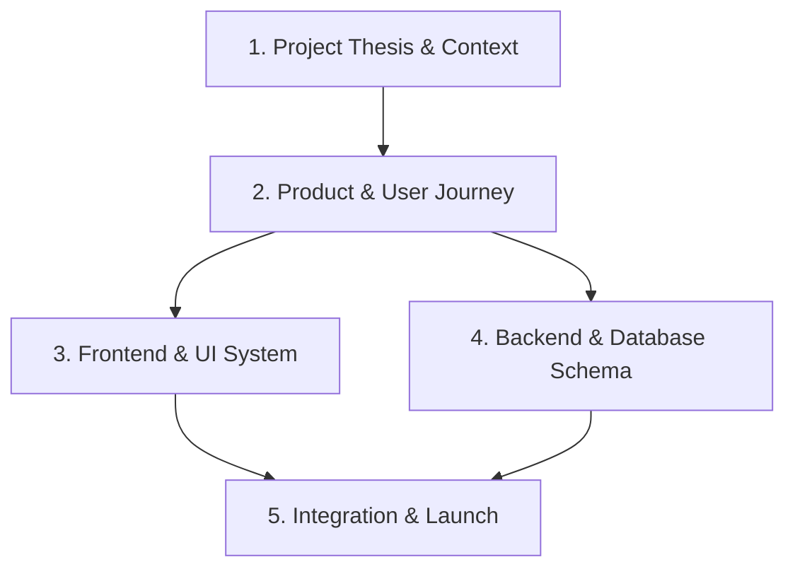

# VAR Room - Documentation Index

Welcome to the **VAR Room** documentation directory. This repository contains the canonical specifications, architectures, and strategies for the VAR Room application.

To enable fast execution and onboarding, follow the recommended agent reading sequence below.

---

## 🧭 Agent Onboarding & Reading Sequence

For any new agent or developer working on the repository, read the documents in this specific order to understand the project from thesis to implementation:

1. **Thesis & Context:** Understand *why* we are building this and the strict rules governing the project.
2. **Product Specs:** Learn the exact flow of the incidents and user journey.
3. **Architecture (Frontend/Backend):** Inspect the technical layouts and API contracts.
4. **Execution & Risk:** Study the demo script, defense playbook, and roadmaps.

---

## 📂 Directory Map & File Registry

### 01. Strategy & Thesis (`docs/01_strategy/`)
Contains the core strategic thesis, competition moats, and high-level AI approach.
* 📝 [project_thesis.md](file:///d:/Projects/InsideTheRoom/docs/01_strategy/project_thesis.md) — The intellectual core of the product. The Two-Decision mechanic and locked principles.
* 📝 [challenge_context.md](file:///d:/Projects/InsideTheRoom/docs/01_strategy/challenge_context.md) — Meta-strategy: IBM SkillsBuild goals, competitive landscape, and disqualification gates.
* 📝 [granite_strategy.md](file:///d:/Projects/InsideTheRoom/docs/01_strategy/granite_strategy.md) — Multi-layer approach resolving the tension between demo safety and real AI necessity.
* 📝 [incident_registry.md](file:///d:/Projects/InsideTheRoom/docs/01_strategy/incident_registry.md) — The five canonical incidents and their exact categorization.
* 📝 [demo_strategy.md](file:///d:/Projects/InsideTheRoom/docs/01_strategy/demo_strategy.md) — The 3-minute narrative flow and the ruthless feature-cut hierarchy.

### 02. Product Specifications (`docs/02_product/`)
Details what needs to be built, user interactions, and screen layouts.
* 📝 [product_requirements.md](file:///d:/Projects/InsideTheRoom/docs/02_product/product_requirements.md) — Features, scope constraints, and the LangFlow pipeline requirements.
* 📝 [user_journey.md](file:///d:/Projects/InsideTheRoom/docs/02_product/user_journey.md) — Chronological walk-through of the user experience during the demo.
* 📝 [screen_specifications.md](file:///d:/Projects/InsideTheRoom/docs/02_product/screen_specifications.md) — User actions, inputs, and outputs per screen.
* 📝 [incident_content_registry.md](file:///d:/Projects/InsideTheRoom/docs/02_product/incident_content_registry.md) — The full content payload for all five incidents.

### 03. Frontend & UI System (`docs/03_frontend/`)
Specifies design system values, reusable components, and client-side logic.
* 📝 [ui_system.md](file:///d:/Projects/InsideTheRoom/docs/03_frontend/ui_system.md) — Design system, colors, glassmorphism tokens, and micro-animations.
* 📝 [component_registry.md](file:///d:/Projects/InsideTheRoom/docs/03_frontend/component_registry.md) — Reusable React component specifications (e.g., `DecisionPanel`, `RevealCard`).
* 📝 [frontend_architecture.md](file:///d:/Projects/InsideTheRoom/docs/03_frontend/frontend_architecture.md) — React/Next.js/Vite routing, local state management, and asset optimization.

### 04. Backend & Integration (`docs/04_backend/`)
Outlines backend services, endpoints, data stores, and LangFlow details.
* 📝 [backend_architecture.md](file:///d:/Projects/InsideTheRoom/docs/04_backend/backend_architecture.md) — Subsystems, CDN delivery layer, and proxy routing structure.
* 📝 [api_contracts.md](file:///d:/Projects/InsideTheRoom/docs/04_backend/api_contracts.md) — Request/Response schemas, validation rules, and status codes.
* 📝 [database_schema.md](file:///d:/Projects/InsideTheRoom/docs/04_backend/database_schema.md) — Static document schema (JSON) alongside a future PostgreSQL relational schema.
* 📝 [granite_integration_design.md](file:///d:/Projects/InsideTheRoom/docs/04_backend/granite_integration_design.md) — watsonx.ai settings, Prompt engineering flows, and grounding guidelines.

### 05. Demo & Project Management (`docs/05_project_demo/`)
Provides delivery support assets, risk logs, and the launch timeline.
* 📝 [demo_script.md](file:///d:/Projects/InsideTheRoom/docs/05_project_demo/demo_script.md) — Minute-by-minute transcript and visual directions for presenting.
* 📝 [narration_script.md](file:///d:/Projects/InsideTheRoom/docs/05_project_demo/narration_script.md) — Narrator guide to keep delivery within the tight 3-minute limit.
* 📝 [judge_defense_playbook.md](file:///d:/Projects/InsideTheRoom/docs/05_project_demo/judge_defense_playbook.md) — Preempted questions and strategic responses for Q&A.
* 📝 [implementation_roadmap.md](file:///d:/Projects/InsideTheRoom/docs/05_project_demo/implementation_roadmap.md) — Timeline, milestones, and overengineering warning signs.
* 📝 [engineering_risk_register.md](file:///d:/Projects/InsideTheRoom/docs/05_project_demo/engineering_risk_register.md) — Critical mitigations and immediate fallbacks for live-system failures.
